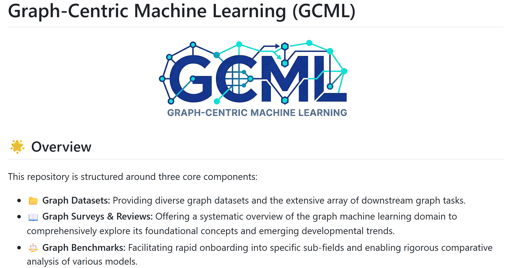

闫页宇 现为[北京交通大学](https://www.bjtu.edu.cn/index.htm)[信息科学研究所](http://mepro.bjtu.edu.cn/)三年级博士研究生，导师为 [Zhenfeng Zhu](https://scholar.google.com.hk/citations?hl=zh-CN&user=fycBie4AAAAJ) 教授和 [Shuai Zheng](https://scholar.google.com.hk/citations?hl=zh-CN&user=8UFwA_0AAAAJ) 教授。在此之前，他于山东科技大学电子信息工程学院获得硕士和学士学位，导师为 [Chao Li](https://dblp.org/pid/66/190-22.html) 教授和 [Zhongying Zhao](https://scholar.google.com.hk/citations?hl=zh-CN&user=fWxlVQIAAAAJ&view_op=list_works&sortby=pubdate) 教授，毕业时间分别为 2023 年和 2020 年。

&#x1F4E7; 邮箱：[yanyeyu-work@foxmail.com](mailto:yanyeyu-work@foxmail.com)

&#x1F393; 研究方向
------
我的研究聚焦于 <strong>数据中心机器学习（Data-centric Machine Learning, DCML）</strong>，主要包括 <strong>图机器学习</strong> 与 <strong>数据赋能 AI</strong>。

- <strong>图机器学习</strong>：当前图神经网络仍主要沿用 Transformer 或 Message Passing 架构，性能提升的重点正逐步从模型改进转向数据改进。我的核心关注点是在更低成本、更短周期内获取大规模高质量图数据，主要从图数据的质量、数量和效率三个角度展开研究。具体方向包括：异构图神经网络、自监督图学习、联邦图学习、图浓缩和图基础模型。

- <strong>数据赋能 AI</strong>：随着图数据研究的局限性逐步显现，这一方向将从图数据研究扩展到更一般的数据研究，通过引入图结构思想提升模型、模块或智能体之间的协同效率。借助图，可以更显式地建立 LLM 或 Agent 之间的关联，进一步释放它们的表达与协作能力。具体方向包括：数据估值、数据蒸馏、LLM 量化、模型融合和多智能体系统。

&#x1F3AF; 近期重点工作
------
目前，我正在与长期合作者 [Xiangkai Zhu](https://scholar.google.com.hk/citations?hl=zh-CN&user=27KjHb8AAAAJ) 一起推进 GCML 的系统性研究工作，内容涵盖更丰富的领域 **数据集**、更广泛的评测 **指标**、更完整的 **综述**、更系统的 **基准** 与更深入的 **洞察**。[项目链接](https://github.com/SuperYeYu/GCML-Notes)

&#x1F525; 最新进展
------
- <strong>2026-04</strong>：1 篇论文被 <strong>ICML</strong> 录用。

- <strong>2026-01</strong>：1 篇论文被 <strong>WWW</strong> 录用。

- <strong>2025-12</strong>：1 篇论文被 <strong>TNNLS</strong> 录用。

- <strong>2025-11</strong>：1 篇论文被 <strong>AAAI</strong> 录用。

- **2025-10**：1 篇论文被 **TNSE** 录用。

- <strong>2025-09</strong>：1 篇论文被 <strong>NeurIPS</strong> 录用。

- <strong>2025-06</strong>：1 篇论文被 <strong>INS</strong> 录用。

- <strong>2025-06</strong>：1 篇论文被 <strong>PR</strong> 录用。

- <strong>2025-04</strong>：1 篇论文被 <strong>IJCAI</strong> 录用。

- <strong>2025-02</strong>：1 篇论文被 <strong>VLDB</strong> 录用。

|           | **2025** | **2026** | **2027** |
| :-------: | :------: | :------: | :------: |
| **NIPS**  | &#x2B50; |          |          |
| **IJCAI** | &#x2B50; |          |          |
| **VLDB**  | &#x2B50; |          |          |
| **AAAI**  |          | &#x2B50; |          |
|  **WWW**  |          | &#x2B50; |          |
| **ICML**  |          | &#x2B50; |          |
|  **KDD**  |          |          |          |

&#x1F4D1; 代表性论文
------
1. [HarmoFGL: Harmonizing GNN Latent Factors for Federated Graph Learning]()  
    IEEE Transactions on Neural Networks and Learning Systems (TNNLS), 2026  
    <strong>Yeyu Yan</strong>, Zhenfeng Zhu, Shuai Zheng, Hongli Xu, Yawei Zhao, Kunlun He, Yao Zhao   

2. [Towards Pre-trained Graph Condensation via Optimal Transport](https://arxiv.org/pdf/2509.14722)  
    Neural Information Processing Systems (NeurIPS), 2025  
    *<u>本工作获得中国电子学会资助</u>*  
    <strong>Yeyu Yan</strong>, Shuai Zheng, Wenjun Hui, Xiangkai Zhu, Dong Chen, Zhenfeng Zhu, Yao Zhao, Kunlun He

3. [A Fast and Robust Attention-free Heterogeneous Graph Convolutional Network ](https://ieeexplore.ieee.org/abstract/document/10463147)  
    IEEE Transactions on Big Data (IEEE TBD), 2024  
    <strong>Yeyu Yan</strong>, Zhongying Zhao, Zhan Yang, Yanwei Yu, Chao Li

4. [OSGNN: Original graph and subgraph aggregated graph neural network](https://www.sciencedirect.com/science/article/pii/S0957417423006176)  
    Expert Systems with Applications (ESWA), 2023  
    <strong>Yeyu Yan</strong>, Chao Li, Yanwei Yu, Xiangju Li, Zhongying Zhao

5. [HetReGAT-FC: Heterogeneous residual graph attention network via feature completion](https://www.sciencedirect.com/science/article/pii/S0020025523003316)  
    Information Sciences (INS), 2023  
    Chao Li, <strong>Yeyu Yan</strong>, Jinhu Fu, Zhongying Zhao, Qingtian Zeng

6. [HEPre: Click frequency prediction of applications based on heterogeneous information network embedding](https://journals.sagepub.com/doi/abs/10.3233/JIFS-211488)  
    Journal of Intelligent & Fuzzy Systems (JIFS), 2021  
    Chao Li, <strong>Yeyu Yan</strong>, Zhongying Zhao, Jun Luo, Qingtian Zeng

&#x1F4DC; 其他论文
------
1. [Mitigating Dynamic Graph Distribution Shifts via Mixture of Variational Experts ]()  
     WWW, 2026  
     Qianyu Song, Chao Li, **Yeyu Yan**, Hui Zhou, Zhongying Zhao, Qingtian Zeng
2. [Stage-Aware Graph Contrastive Learning with Node-oriented Mixture of Experts ]()  
     AAAI, 2026  
     Xiangkai Zhu, **Yeyu Yan**, Saiqin Long, Chao Li, Longsheng Su, Guanwen Chen
3. [MPPQ: Enhancing Post-Training Quantization for LLMs via Mixed Supervision, Proxy Rounding, and Pre-Searching ](https://www.ijcai.org/proceedings/2025/920)  
     IJCAI, 2025  
     Mingrun Wei, <strong>Yeyu Yan</strong>, Dong Wang
4. [OpenFGL: A Comprehensive Benchmark for Federated Graph Learning ](https://www.vldb.org/pvldb/vol18/p1305-li.pdf)  
     VLDB, 2025   
     Xunkai Li, Yinlin Zhu, Boyang Pang, Guochen Yan, **Yeyu Yan**, Zening Li, Zhengyu Wu, Wentao Zhang, Rong-Hua Li, Guoren Wang
5. [Adaptive Graph Filtering Neural Network for Graph Anomaly Detection ]()  
     IEEE Transactions on Network Science and Engineering (TNSE), 2025  
     Zhizhe Liu, Shuai Zheng, **Yeyu Yan**, Zhenfeng Zhu, Yao Zhao
6. [NodeHGAE: Node-oriented Heterogeneous Graph Autoencoder](https://www.sciencedirect.com/science/article/pii/S0020025525005808)  
     Information Sciences (INS), 2025  
     Xiangkai Zhu, Chao Li, <strong>Yeyu Yan</strong>, Zhongying Zhao, Hua Duan, Qingtian Zeng
7. [Efficiently Harmonizing Information Sharing for Heterogeneous Graph Contrastive Learning ](https://www.sciencedirect.com/science/article/pii/S0031320325005333)  
     Pattern Recognition (PR), 2025  
     Xiangkai Zhu, Chao Li, <strong>Yeyu Yan</strong>, Jinhu Fu, Zhongying Zhao, Qingtian Zeng
8. [MHGNN: Multi-view fusion based heterogeneous graph neural network ](https://link.springer.com/article/10.1007/s10489-024-05567-y)  
     Applied Intelligence (APIN), 2024   
     Chao Li, Xiangkai Zhu, <strong>Yeyu Yan</strong>, Zhongying Zhao, Lingtao Su, Qingtian Zeng
9. [Higher order heterogeneous graph neural network based on node attribute enhancement](https://www.sciencedirect.com/science/article/pii/S0957417423029068)   
     Expert Systems with Applications (ESWA), 2024  
     Chao Li, Jinhu Fu, <strong>Yeyu Yan</strong>, Zhongying Zhao, Qingtian Zeng
10. [HetGNN-SF: Self-supervised learning on heterogeneous graph neural network via semantic strength and feature similarity](https://link.springer.com/article/10.1007/s10489-023-04612-6)  
     Applied Intelligence (APIN), 2023  
     Chao Li, Xinming Liu, <strong>Yeyu Yan</strong>, Zhongying Zhao, Qingtian Zeng
11. [Self-Supervised Heterogeneous Graph Neural Network Model Based on Collaborative Contrastive Learning of Topology Information and Attribute Information ](http://manu46.magtech.com.cn/Jweb_prai/EN/abstract/abstract12534.shtml#)  
     Pattern Recognition and Artificial Intelligence, 2023  
     Chao Li, Guoyi Sun, <strong>Yeyu Yan</strong>, Hua Duan, Qingtian Zeng

&#x1F4CC; 学术服务
------
- 会议审稿：
  **ICDE** 2024、**ICML** 2024、**IJCAI** 2025、**AAAI** 2026、**CVPR** 2026、**ECCV** 2026、**ICML** 2026

- 期刊审稿：
  Transactions on Machine Learning Research (**TMLR**)、Transactions on Knowledge Discovery from Data (**TKDD**)、Pattern Recognition (**PR**)、Artificial Intelligence Review (**AIR**)、Knowledge-Based Systems (**KBS**)、Neural Networks、Scientific Reports、Journal of Big Data、Cognitive Computation

&#x1F4BB; 实习经历
------
1. <strong>研究实习生</strong>
    单位：北京大学 DCML Group
    合作导师：张文涛 教授
    时间：2024.01 至今

2. <strong>研究实习生</strong>
    单位：中国人民解放军总医院医学大数据研究中心
    合作导师：赵亚威 博士
    时间：2023.11 至今

3. <strong>研究实习生</strong>
    单位：云鼎科技 AI Research Center
    合作导师：高桢 研究员
    时间：2022.12 至 2023.02

&#x1F3C6; 荣誉奖励
------
1. [山东省优秀硕士学位论文](http://edu.shandong.gov.cn/module/download/downfile.jsp?classid=0&filename=db4a1dba57be4de8bfb007cb60108046.pdf)，2025
2. [山东人工智能学会优秀硕士学位论文](https://download.wezhan.cn/contents/sitefiles2071/10358509/files/876434..pdf?response-content-disposition=inline%3Bfilename%3D%25e9%2599%2584%25e4%25bb%25b61%25ef%25bc%259a%25e5%25b1%25b1%25e4%25b8%259c%25e7%259c%2581%25e4%25ba%25ba%25e5%25b7%25a5%25e6%2599%25ba%25e8%2583%25bd%25e4%25bc%2598%25e7%25a7%2580%25e5%25ad%25a6%25e4%25bd%258d%25e8%25ae%25ba%25e6%2596%2587%25e6%258b%259f%25e8%258e%25b7%25e5%25a5%2596%25e5%2590%258d%25e5%258d%2595.pdf.pdf&response-content-type=application%2Fpdf&auth_key=1751358822-a88cca395fce421d9e1563cf92222626-0-bb55b9a7d6468184e134d21a1f075834)，2024
3. [山东计算机学会优秀硕士学位论文](http://sd-cf.com.cn/info/933.jspx)，2024
