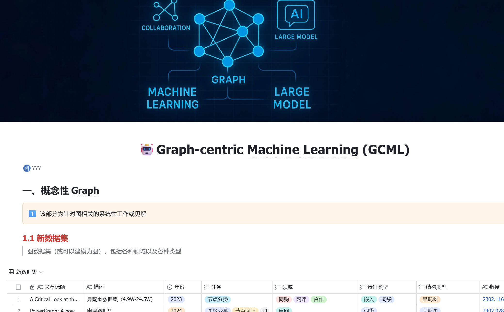

Currently, Yeyu Yan is is a third year Ph.D. student of [the Institute of Information Science](http://mepro.bjtu.edu.cn/) in [Beijing Jiaotong University](https://www.bjtu.edu.cn/index.htm), supervised by Prof. [Zhenfeng Zhu](https://scholar.google.com.hk/citations?hl=zh-CN&user=fycBie4AAAAJ) and Prof. [Shuai Zheng](https://scholar.google.com.hk/citations?hl=zh-CN&user=8UFwA_0AAAAJ). Prior to that, he received his M.S. and B.E. degrees in the School of Electronics and Information Engineering from Shandong University of Science and Technology, supervised by Prof. [Chao Li](https://dblp.org/pid/66/190-22.html) and Prof. [Zhongying Zhao](https://scholar.google.com.hk/citations?hl=zh-CN&user=fWxlVQIAAAAJ&view_op=list_works&sortby=pubdate),  with graduation years of 2023 and 2020, respectively.

&#x1F4E7; E-mail: [yanyeyu-work@foxmail.com]()

&#x1F393; Research Interests
------
My research interests center on <strong>Graph-centric Machine Learning (GCML)</strong>, including <strong>Graph Machine Learning</strong> and <strong>Graph-empowered AI</strong>.

- <strong>Graph Machine Learning</strong>: Currently, graph neural networks have continued to adopt Transformer or message passing architectures, with performance gains shifting from model improvements to data improvements. My primary focus is on obtaining large quantities of high-quality data at lower costs and in shorter timeframes, by approaching from the perspectives of graph quality, quantity, and efficiency. The main research areas are: heterogeneous graph neural networks, self-supervised graph learning, federated graph learning, graph condensation, and graph foundation models.

- <strong>Graph-empowered AI</strong>: As the limitations of graph data gradually become apparent, this research theme will transition from the study of graph data to the study of general data, by introducing graph concepts to enhance the collaborative efficiency between models, modules, or agents. Through graphs, LLMs or agents can be explicitly associated, further unleashing their expressive capabilities. The main research areas are: retrieval-augmented generation, and Agentic AI.

&#x1F3AF; More importantly, I am collaborating with my long-term partner [Xiangkai Zhu](https://scholar.google.com.hk/citations?hl=zh-CN&user=27KjHb8AAAAJ) on a conceptual studys for GCML. This encompasses more diverse domain **datasets**, wider range of evaluation **metrics**, more comprehensive **surveys**, more systematic **benchmarks**, and deeper **insights**. This study will be published shortly.

&#x1F525; News
------
- <strong>2025-11</strong>: One paper is accepted by <strong>AAAI</strong> conference.

- **2025-10**: One paper is accepted by **TNSE** journal.

- <strong>2025-09</strong>: One paper is accepted by <strong>NeurIPS</strong> conference.

- <strong>2025-06</strong>: One paper is accepted by <strong>INS</strong> journal.

- <strong>2025-06</strong>: One paper is accepted by <strong>PR</strong> journal.

- <strong>2025-04</strong>: One paper is accepted by <strong>IJCAI</strong> conference.

- <strong>2025-02</strong>: One paper is accepted by <strong>VLDB</strong> conference.  

  
  
  |          |   NIPS   |   AAAI   |  IJCAI   |   VLDB   |
  | :------: | :------: | :------: | :------: | :------: |
  | **2025** | &#x2B50; | &#x2B50; | &#x2B50; | &#x2B50; |
  | **2026** |          |          |          |          |
  
  

&#x1F4D1; Selected Publications
------
1. [Towards Pre-trained Graph Condensation via Optimal Transport]([Towards Pre-trained Graph Condensation via Optimal Transport](https://arxiv.org/pdf/2509.14722))  
    Neural Information Processing Systems (NeurIPS), 2025  
    <strong>Yeyu Yan</strong>, Shuai Zheng, Wenjun Hui, Xiangkai Zhu, Dong Chen, Zhenfeng Zhu, Yao Zhao, Kunlun He

2. [A Fast and Robust Attention-free Heterogeneous Graph Convolutional Network](https://ieeexplore.ieee.org/abstract/document/10463147)  
    IEEE Transactions on Big Data (IEEE TBD), 2024  
    <strong>Yeyu Yan</strong>, Zhongying Zhao, Zhan Yang, Yanwei Yu, Chao Li

3. [OSGNN: Original graph and subgraph aggregated graph neural network](https://www.sciencedirect.com/science/article/pii/S0957417423006176)  
    Expert Systems with Applications (ESWA), 2023  
    <strong>Yeyu Yan</strong>, Chao Li, Yanwei Yu, Xiangju Li, Zhongying Zhao

4. [HetReGAT-FC: Heterogeneous residual graph attention network via feature completion](https://www.sciencedirect.com/science/article/pii/S0020025523003316)  
    Information Sciences (INS), 2023  
    Chao Li (Advisor), <strong>Yeyu Yan</strong>, Jinhu Fu, Zhongying Zhao, Qingtian Zeng

5. [HEPre: Click frequency prediction of applications based on heterogeneous information network embedding](https://journals.sagepub.com/doi/abs/10.3233/JIFS-211488)  
    Journal of Intelligent & Fuzzy Systems (JIFS), 2021  
    Chao Li (Advisor), <strong>Yeyu Yan</strong>, Zhongying Zhao, Jun Luo, Qingtian Zeng

&#x1F4DC; Other Publications
------
1. [Stage-Aware Graph Contrastive Learning with Node-oriented Mixture of Experts]()  
     AAAI, 2026  
     Xiangkai Zhu, **Yeyu Yan**, Saiqin Long, Chao Li, Longsheng Su, Guanwen Chen
2. [MPPQ: Enhancing Post-Training Quantization for LLMs via Mixed Supervision, Proxy Rounding, and Pre-Searching]([MPPQ: Enhancing Post-Training Quantization for LLMs via Mixed Supervision, Proxy Rounding, and Pre-Searching | IJCAI](https://www.ijcai.org/proceedings/2025/920))  
     IJCAI, 2025  
     Mingrun Wei, <strong>Yeyu Yan</strong>, Dong Wang
3. [OpenFGL: A Comprehensive Benchmark for Federated Graph Learning]([OpenFGL: A Comprehensive Benchmark for Federated Graph Learning](https://www.vldb.org/pvldb/vol18/p1305-li.pdf))  
     VLDB, 2025  
     Xunkai Li, Yinlin Zhu, Boyang Pang, Guochen Yan, **Yeyu Yan**, Zening Li, Zhengyu Wu, Wentao Zhang, Rong-Hua Li, Guoren Wang
4. [Adaptive Graph Filtering Neural Network for Graph Anomaly Detection]()  
     IEEE Transactions on Network Science and Engineering (TNSE), 2025   
     Zhizhe Liu, Shuai Zheng, **Yeyu Yan**, Zhenfeng Zhu, Yao Zhao
5. [NodeHGAE: Node-oriented Heterogeneous Graph Autoencoder](https://www.sciencedirect.com/science/article/pii/S0020025525005808)  
     Information Sciences (INS), 2025  
     Xiangkai Zhu, Chao Li, <strong>Yeyu Yan</strong>, Zhongying Zhao, Hua Duan, Qingtian Zeng
6. [Efficiently Harmonizing Information Sharing for Heterogeneous Graph Contrastive Learning](https://www.sciencedirect.com/science/article/pii/S0031320325005333)  
     Pattern Recognition (PR), 2025  
       Xiangkai Zhu, Chao Li, <strong>Yeyu Yan</strong>, Jinhu Fu, Zhongying Zhao, Qingtian Zeng
7. [MHGNN: Multi-view fusion based heterogeneous graph neural network](https://link.springer.com/article/10.1007/s10489-024-05567-y)   
     Applied Intelligence (APIN), 2024  
       Chao Li, Xiangkai Zhu, <strong>Yeyu Yan</strong>, Zhongying Zhao, Lingtao Su, Qingtian Zeng
8. [Higher order heterogeneous graph neural network based on node attribute enhancement](https://www.sciencedirect.com/science/article/pii/S0957417423029068)  
     Expert Systems with Applications (ESWA), 2024  
       Chao Li, Jinhu Fu, <strong>Yeyu Yan</strong>, Zhongying Zhao, Qingtian Zeng
9. [HetGNN-SF: Self-supervised learning on heterogeneous graph neural network via semantic strength and feature similarity](https://link.springer.com/article/10.1007/s10489-023-04612-6)  
     Applied Intelligence (APIN), 2023  
       Chao Li, Xinming Liu, <strong>Yeyu Yan</strong>, Zhongying Zhao, Qingtian Zeng
10. [Self-Supervised Heterogeneous Graph Neural Network Model Based on Collaborative Contrastive Learning of Topology Information and Attribute Information](http://manu46.magtech.com.cn/Jweb_prai/EN/abstract/abstract12534.shtml#)  
     Pattern Recognition and Artificial Intelligence, 2023  
       Chao Li, Guoyi Sun, <strong>Yeyu Yan</strong>, Hua Duan, Qingtian Zeng 

&#x1F4CC; Service
------
- Conference Reviewers:
  - ICDE 2024, ICML 2024, IJCAI 2025, AAAI 2026

- Journal Reviewers:
  - Transactions on Knowledge Discovery from Data, Artificial Intelligence Review, Scientific Reports, Journal of Big Data, Cognitive Computation

&#x1F4BB; Internships
------
1. <strong>Research Intern</strong>  
    Company/Institution: DCML Group, Peking University  
    Advisor: Prof. Wentao Zhang  
    Employment period: From 01/2024 to the present
  
2. <strong>Research Intern</strong>  
    Company/Institution: Medical Big Data Research Center, Chinese PLA General Hospital  
    Advisor: Dr. Yawei Zhao  
    Employment period: From 11/2023 to the present
  
3. <strong>Research Intern</strong>  
    Company/Institution: AI Research Center, Yunding Technology Co.,Ltd  
    Advisor: Researcher Zhen Gao  
    Employment period: From 12/2022 to 02/2023

&#x1F3C6; Honors and Awards
------
1. [Outstanding Master's Dissertation Award](http://edu.shandong.gov.cn/module/download/downfile.jsp?classid=0&filename=db4a1dba57be4de8bfb007cb60108046.pdf), Shandong (32 people in SDUST, and 548 people in Shandong), 2025
2. [Outstanding Master's Dissertation Award](https://download.wezhan.cn/contents/sitefiles2071/10358509/files/876434..pdf?response-content-disposition=inline%3Bfilename%3D%25e9%2599%2584%25e4%25bb%25b61%25ef%25bc%259a%25e5%25b1%25b1%25e4%25b8%259c%25e7%259c%2581%25e4%25ba%25ba%25e5%25b7%25a5%25e6%2599%25ba%25e8%2583%25bd%25e4%25bc%2598%25e7%25a7%2580%25e5%25ad%25a6%25e4%25bd%258d%25e8%25ae%25ba%25e6%2596%2587%25e6%258b%259f%25e8%258e%25b7%25e5%25a5%2596%25e5%2590%258d%25e5%258d%2595.pdf.pdf&response-content-type=application%2Fpdf&auth_key=1751358822-a88cca395fce421d9e1563cf92222626-0-bb55b9a7d6468184e134d21a1f075834), ShanDong Association of Artificial Intelligence (6 people in Shandong), 2024
3. [Outstanding Master's Dissertation Award](http://sd-cf.com.cn/info/933.jspx), Shandong Computer Federation (27 people in Shandong), 2024
